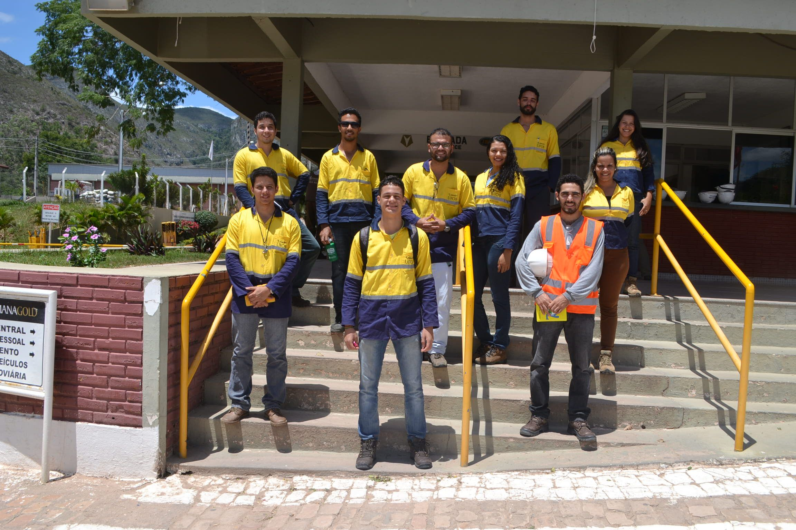
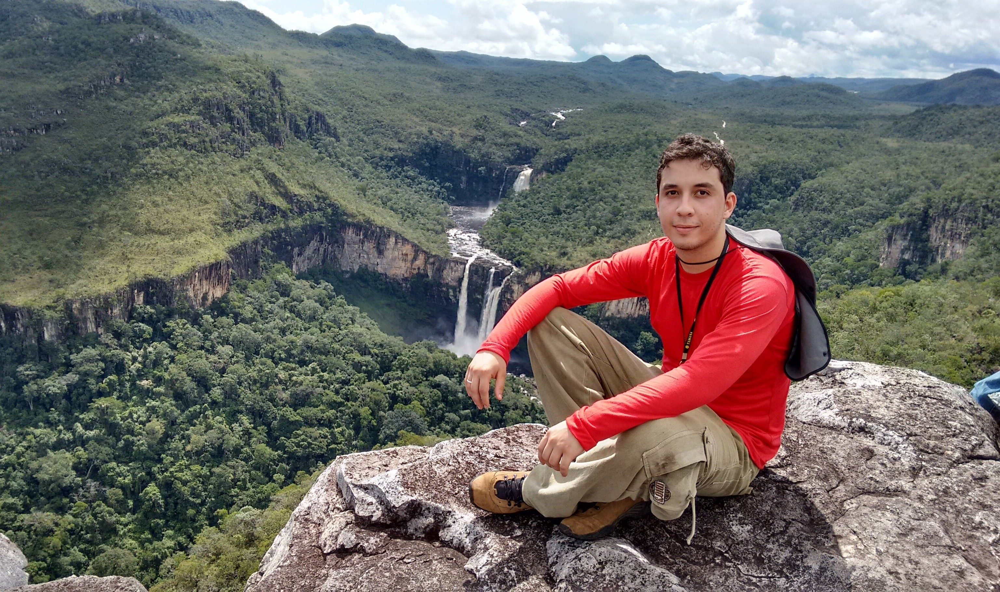

### Nontraditional programming background

I came from a nontraditional programming background,
the only contact I had with something close to 'programming' before the university was when I tried to build private online servers for MMORPG's, but it had more to do with Lego (copying code from somewhere and pasting it without comprehending) than programming itself.

In 2012, I started a 5 year graduation program in geology from the Federal University of Western Bahia, the first 2 years were ok, but at the start of 2014, I got struck by an autoimmune genetic disorder that had put all my life projects on hold.

After almost 3 years of trying countless treatments, medications, a facial paralysis, and some surgeries, the doctors finally found one medication/treatment that worked fine by controlling the symptoms, in fact, I could restart all my life projects again.

### Getting started with programming

As my life had gone back to normal, I started taking classes at the college again, one of them was Introduction to programming and computer science, it began with some theoretical concepts, then I was taught to code using Fortran, with some basic concepts in mind, I made some really simple algorithms, one of them to solve second-degree equations, another to convert Fahrenheit to Celsius, etc... as the classes advanced a whole new world opened for me, the infinite possibilities of building things and solving problems to make life better, to help others...

Found something that made me happy, it was coding, my mind was full of pseudo-code for solving day-to-day issues, it really felt like I was made for that, loved every aspect of it, and the possibility of making it my life career started plugging in my head... So I started studying it in every spare time I had, from freeCodeCamp to programming/webdev related programs from Coursera...

### Merging geology with programming

In the meantime, I wanted to connect both of my activities: geology and programming, into something, then I had the idea of a geology related website, but first, I had to know how to build a website from scratch.

My researches found out that the easiest way was using WordPress, from there I built my first website, dota 2 brasil (it had like 20 plugins, a bit like Frankenstein), after that, I started planning with a friend from college the website that would bring geology related news, and a web store, of course, built using WordPress and woocommerce.

With the website launch, we made an Instagram account and wrote some articles, in a couple of months it had 1k+ unique visitors, some months where there were some successful articles it could easily hit 10k unique visitors, the Instagram page got nearly 17k followers.

After a while, I didn't have the time to keep the website updated, had to focus on the college, plus I wanted to invest more time in learning more and more about programming on my spare time...
On my last semester in college, there was an opportunity to get together my programming knowledge with my geological knowledge on my final thesis, for that, I built the MinID APP, a web application that makes use of an algorithm to help geologists to identify minerals in thin section.

### Current path

Althoug geology taught so many great things and had a great part on what a i became today... After the college, I decided to take a leap of faith and dive completly on doing what i really enjoy, to focus entirly on programming.

